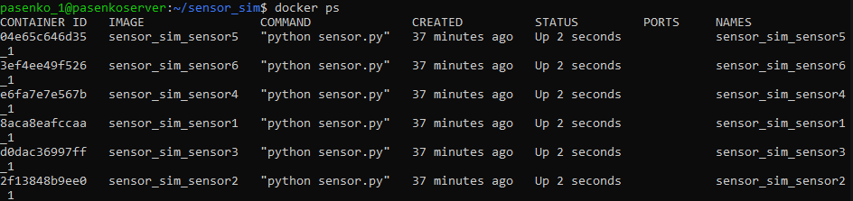
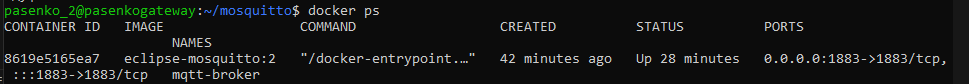
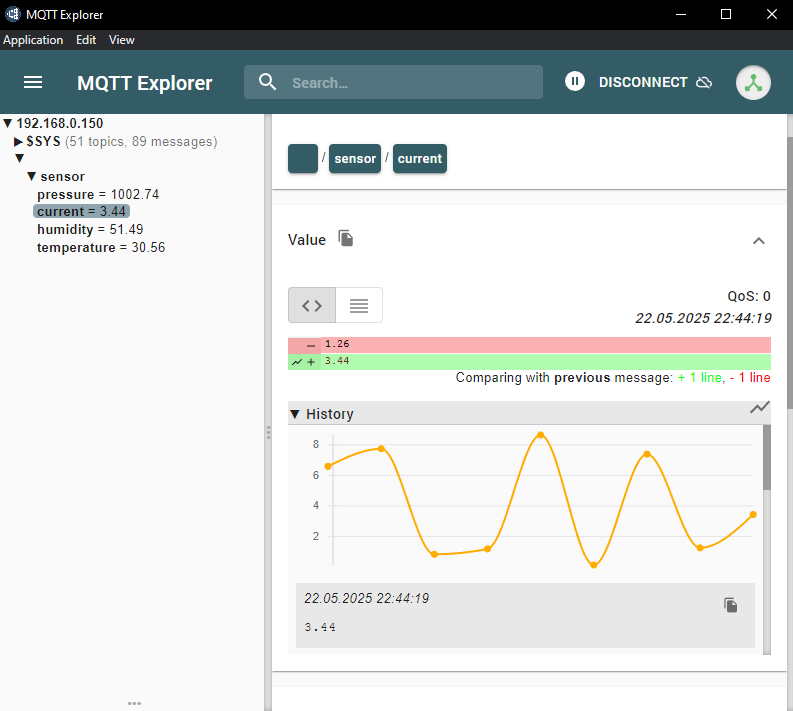
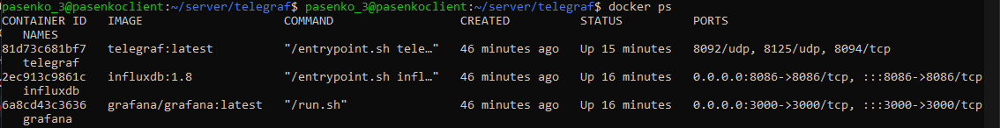
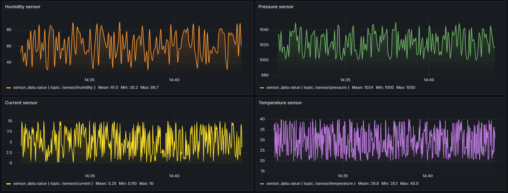

# Отчёт по работе №2: Практика Docker
**Цель:** создать систему мониторинга системы датчиков с использованием Docker, Mosquitto, InfluxDB, Telegraf и Grafana на трёх виртуальных машинах (далее ВМ).

## Подготовка ВМ
1. Взяты три ВМ из работы №1 (предварительно настроены в формате client, server, gateway).
2. Необходимо установить на каждую ВМ Docker и Docker Compose посредством:
```shell
sudo apt update
sudo apt upgrade -y
sudo apt install -y docker.io
sudo systemctl enable docker
sudo systemctl start docker
docker --version
sudo usermod -aG docker $USER
sudo apt install -y docker-compose
docker-compose --version
```

## Настройка vmA (client) - Система сенсоров
1. Создаём папку для приложения (у меня `/sensor-sim`).
2. Далее подготавливаем файлы самого приложения:
    1. `requirements.txt` в одну строку: `paho-mqtt`.
    2. `Dockerfile` для сборки образа и установки зависимости.
    3. Сам скрипт `sensor.py`, в котором описан базовый класс **Sensor** и его наследники. Чтение конфигурации происходит из **env-переменных**.

3. Далее необходимо собрать образ и опубликовать его на Docker Hub:
```shell
docker login
docker build -t palllladium/sensor-sim:latest .
docker push palllladium/sensor-sim:latest
```

4. После этого создаём `docker-compose.yml` для запуска контейнеров из опубликованного образа.<br>
Каждый контейнер имеет свои env-переменные: SENSOR_TYPE, SENSOR_NAME и т.д.<br>
Получаем такую картину:



## Настройка vmB (gateway) - MQTT Broker
1. Создаём папку для MQTT Broker (у меня `/mosquitto`).
2. Далее подготавливаем конфиг (по заданию) и `docker-compose.yml`
3. Также запускаем контейнер и проверяем открытость порта 1883:



В MQTT Explorer можно увидеть, что значения с сенсоров поступают корректно:



## Настройка vmC (server) - Мониторинг

1. Создаём подобную структуру папок:
```shell
server/
├── docker-compose.yml
├── influxdb/
│   ├── influxdb.conf
│   ├── data/
│   ├── meta/
│   └── wal/
├── telegraf/
│   └── telegraf.conf
├── grafana/
│   ├── provisioning/
│   │   ├── datasources/
│   │   │   └── default.yaml
│   │   └── dashboards/
│   │       ├── default.yaml
│   │       └── dashboard.json
```

- Здесь важно было после запуска контейнера `influxdb` создать базу данных вручную при помощи:
```shell
CREATE database sensors
USE sensors
CREATE USER telegraf WITH PASSWORD 'telegraf' WITH ALL PRIVILEGES
```
- И сконфигурировать `telegraf.conf`, изменив:
```shell
[[outputs.influxdb]]
  urls = ["http://influxdb:8086"] # здесь уже указан alias
  database = "sensors"
  username = "telegraf"
  password = "telegraf"

[[inputs.mqtt_consumer]]
  servers = ["tcp://192.168.0.150:1883"] # IP ВМ с MQTT
  topics = ["/sensor/+"]
  data_format = "value"
  data_type = "float"
```

2. В `docker-compose.yml` файле указываем одну сеть для всех контейнеров и указываем отдельно именнованые тома для **Grafana** и **InfluxDB**, также монтируем для обоих контейнеров ранее написанные конфиги.
3. После `docker-compose up -d` необходимо зайти на `http://192.168.0.149:3000` (где уже ожидает графический интерфейс **Grafana**) и сконфигурировать вручную дашборд, предварительно добавив источник данных из **InfluxDB**.
4. JSON созданного дашборда экспортируем и сохраняем в `.../grafana/provisioning/dashboards/dashboard.json`.
5. Перезапускаем контейнер с **Grafana**.



## Тестирование

1. И в теории, и на практике данные генерируются на vmA (работы сенсоров), поступают на vmB (**MQTT Broker**), а далее поступают на vmC (считываются **Telegraf** и сохраняются в **InfluxDB**), отображение же уже происходит в **Grafana** на заранее сконфигурированном дашборде.
2. У всех контейнеров также реализовано сохранение настроек при помощи `restart: unless-stopped` в `docker-compose.yml`.

Финальные результаты работы:



Представленные скриншоты подтверждают работоспособность системы.
Все необходимые файлы приложены в репозитории.
